Jiawei You & Yi Dai

3/24
admin interface:
1:About room management on the admin interface. The following exception is prompted after deleting the room. After clicking Delete, the corresponding room cannot be deleted but a pop-up window of Network request failed will pop up.(The above problem occurred when I logged in the admin interface, entered the room management interface and clicked the delete button to delete the classroom)
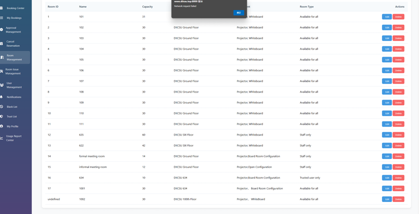
2:After you click room management on the admin screen, the upper secure certificate authentication becomes insecure.(When I enter the room management page in admin, the security certificate prompt on the top is changed)
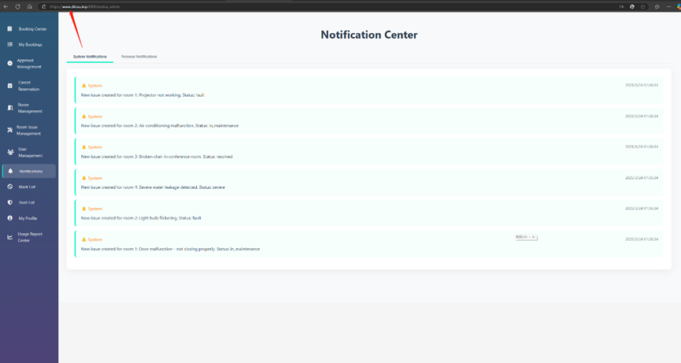 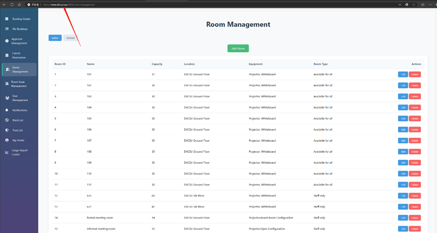

3:When I click on my profile in the sidebar, the corresponding cursor in the sidebar is the usage report center.(The above problem occurs when I enter the admin system and click the sidebar corresponding to my profile)
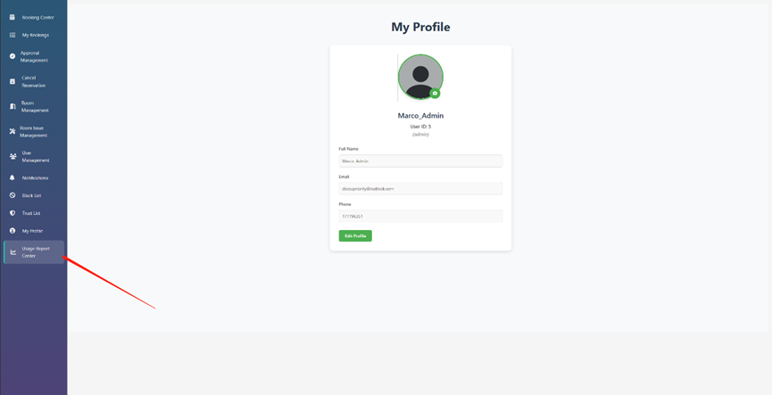

user interface:
1: The book now function of the Booking Centre with the original user interface is not working properly after the suspension window is added. After clicking, the time period does not pop up as shown in the picture below.(When I enter the booking centre interface of the user system, click booking now. The above problems arise)
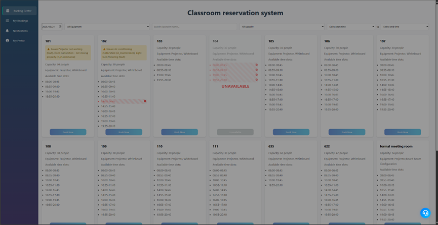

3/25
user interface:
1:The mobile sidebar for user Management and usage Report Center on the admin interface is not displayed correctly.(This happened after I switched to mobile mode and clicked on the two sidebars.)
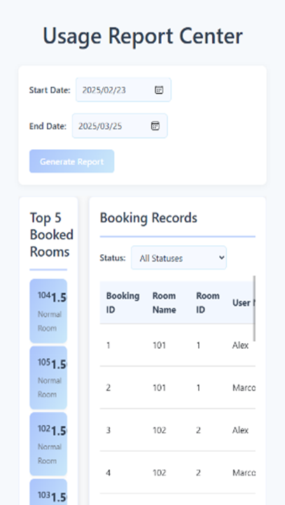

3/26
user interface:
1:When a user books a classroom that requires an administrator review. When the reservation was canceled by the administrator. Booking this classroom for the same time period again will pop up as the reservation failed due to repetition. (This happened after I entered the booking centre interface of the user interface for the same period of time that the second request required an administrator to review the room).
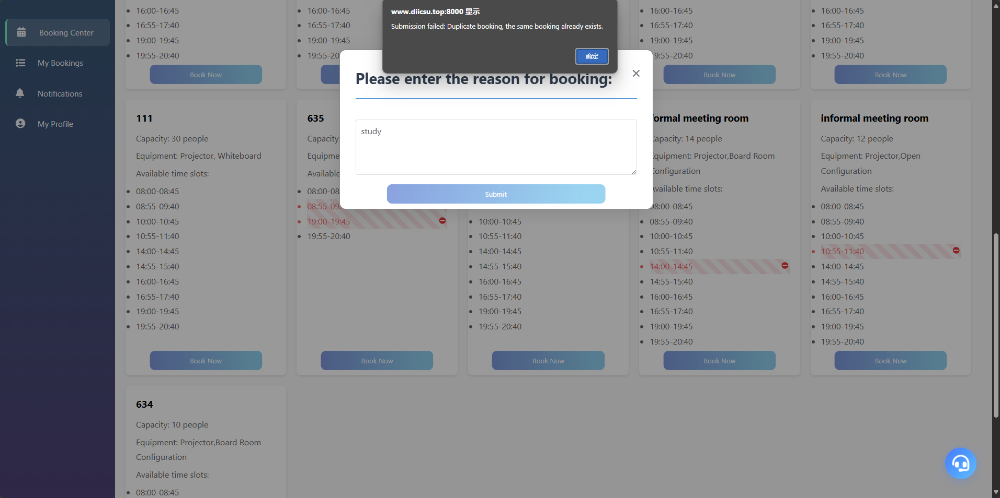

2:When I go to notifications in the admin interface, After I click booking management, room management, and user management in the sidebar there are no response.
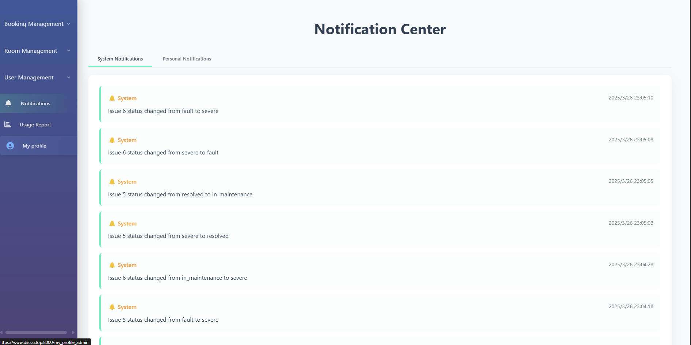

3:When I went to admin's usage report center, the screen was not centered.
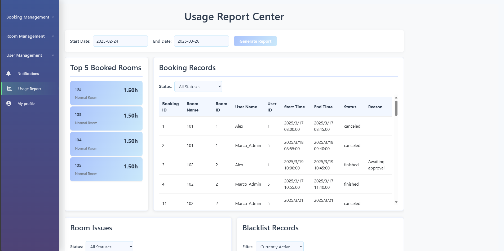

4:When I enter the user interface, I find that the sidebar gap is too large.
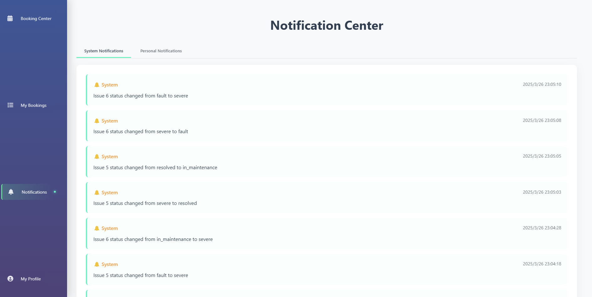

5:There is no feedback if you click the sidebar on the usage report center interface in the mobile admin system.
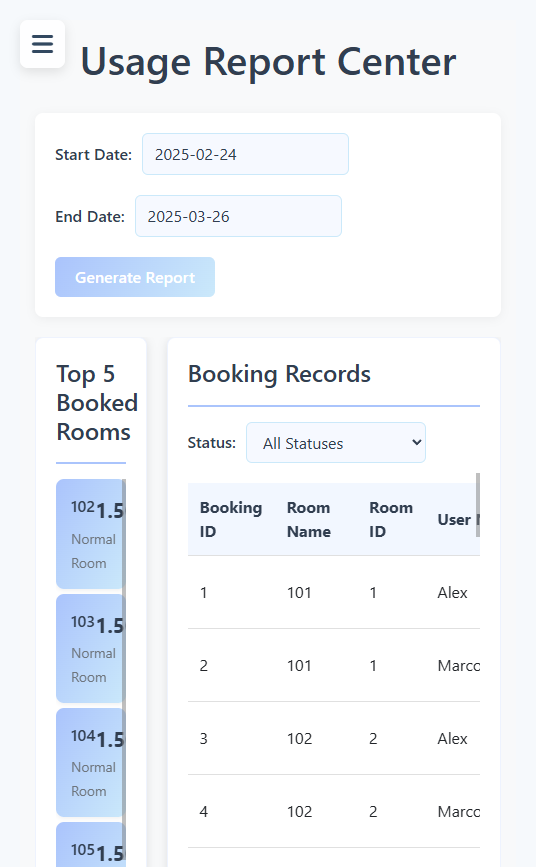

6:The mobile sidebar of the admin system cannot reclaim the sidebar by clicking the area to the right of the sidebar
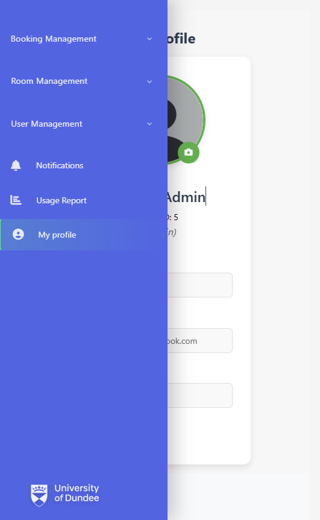

7:The status of the issue management interface on the mobile device cannot be displayed.
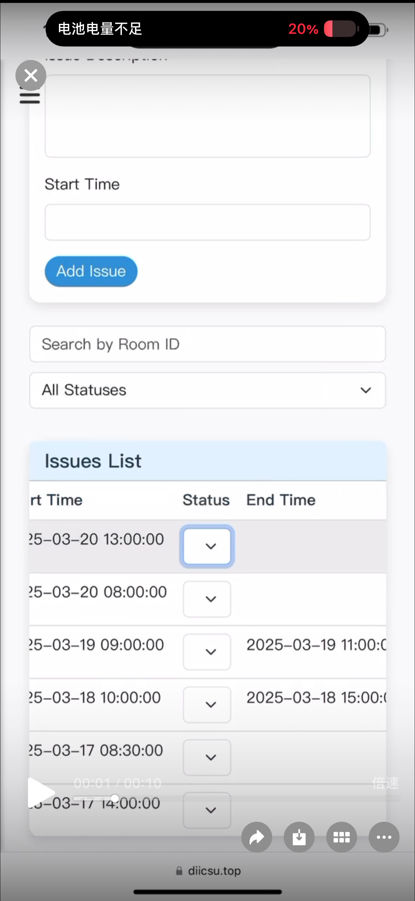

8:There is no sidebar button to invoke User management (Resolved).
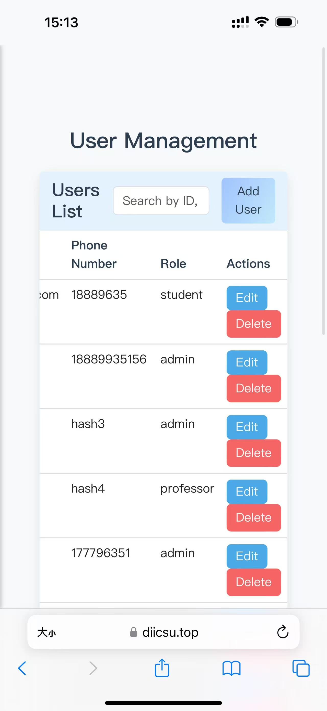

9: The User report cannot be opened, and the text is mixed with icons (Resolved).
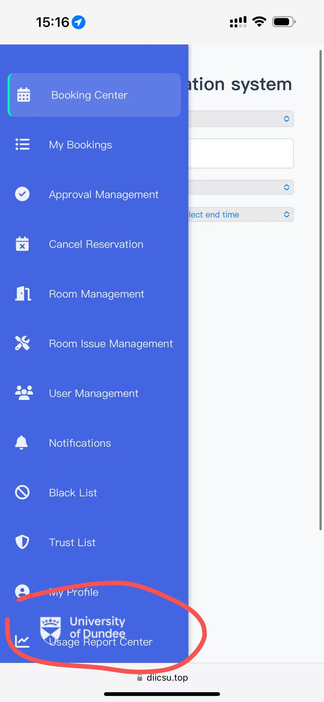

10:The layout of User report is too cramped, and the button for invoking the menu does not respond when clicked.
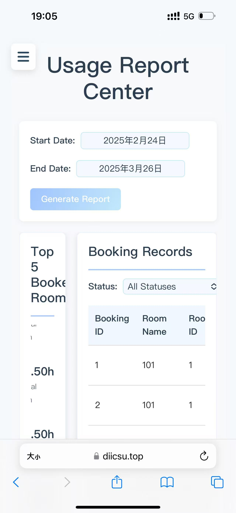

3/27
1:When I requested a room as a user that required administrator approval, after administrator reject the approval  an error popup popped up.
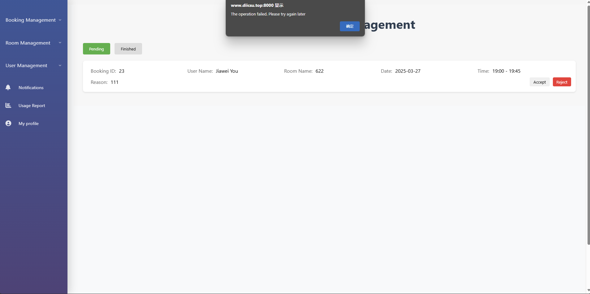

2:When the administrator rejects the approval of a room, the result will not be automatically refreshed. You need to manually refresh the result to observe the operation.
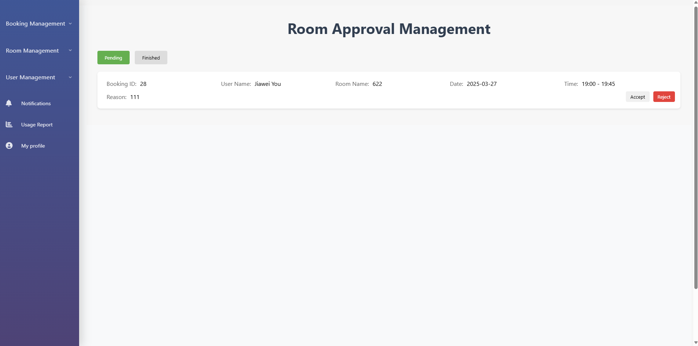

3:When I enter the room approval management of the admin interface and click accept on the pending application of the user, a window for printing the interface will pop up.
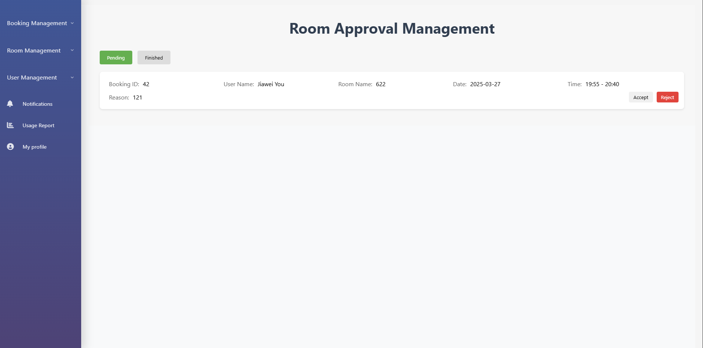
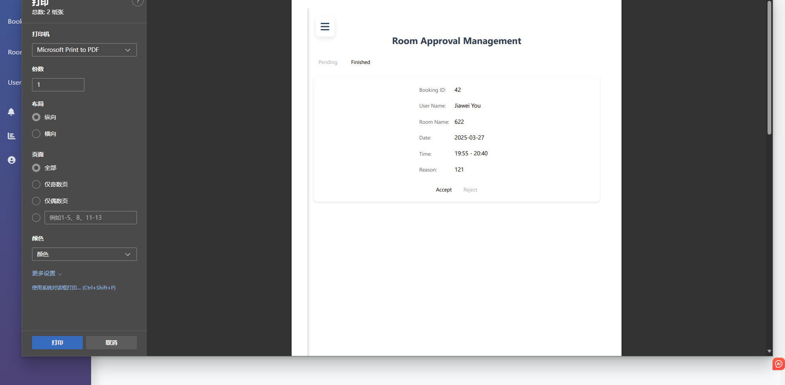

4:The administrator does not receive an email notification after a user is added to the blacklist for three consecutive times in one day.

5:When I used date search in my bookings in the admin interface, the feature did not respond
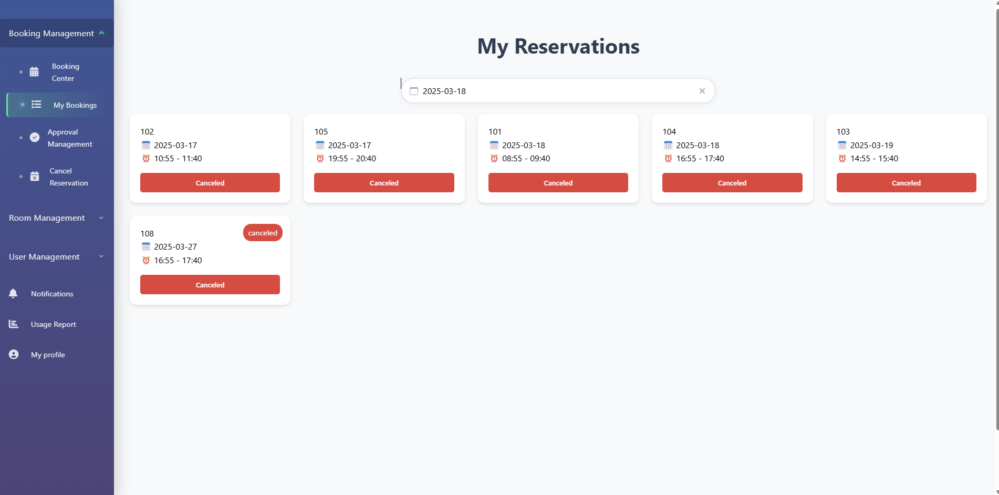

6:What bookings are different between the admin page and the user page? The admin page has a search box but the user page does not.
 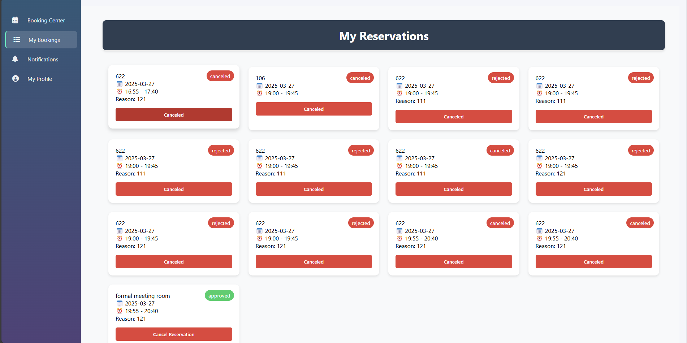
