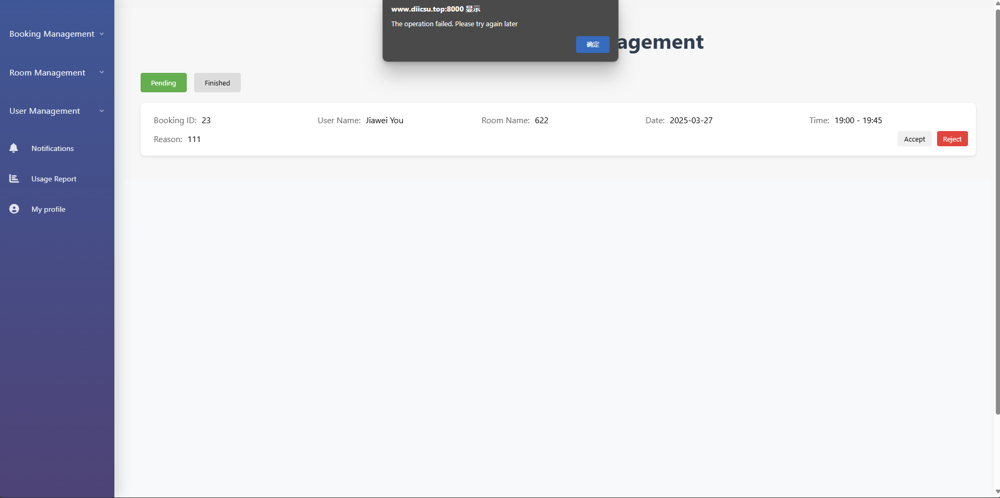
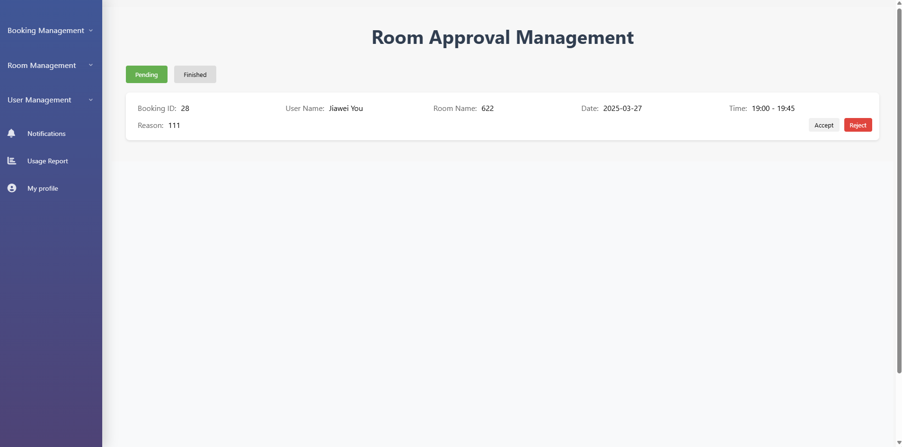
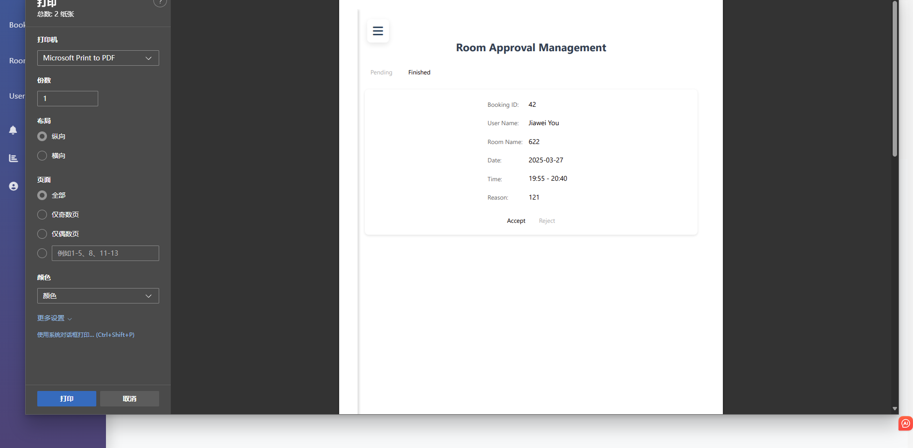
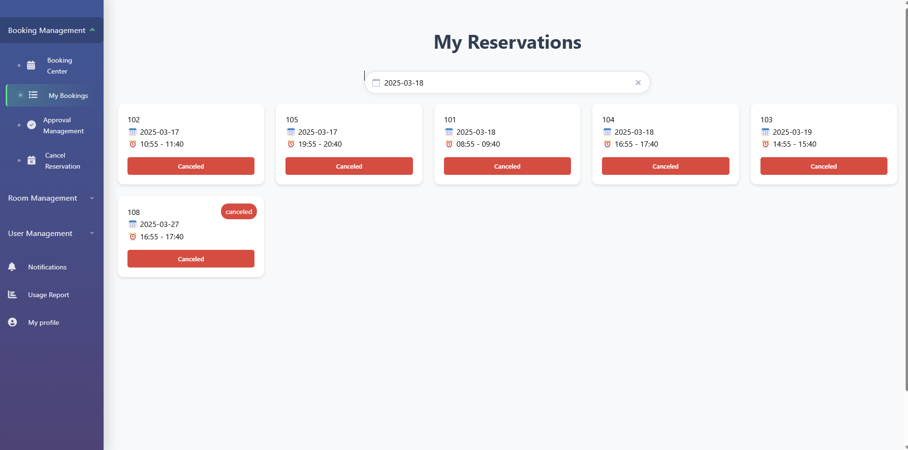
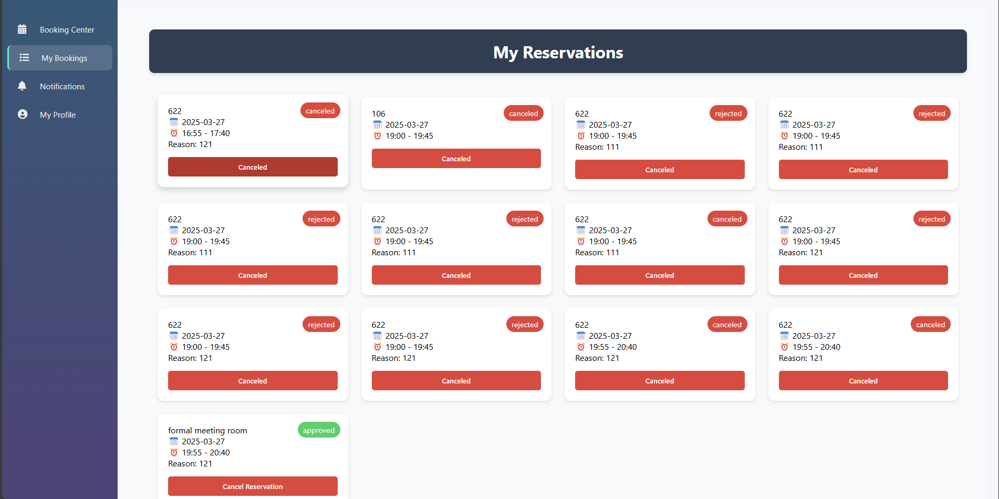

Jiawei You & Yi Dai

admin interface:

1:When I requested a room as a user that required administrator approval, after administrator reject the approval  an error popup popped up.

2:When the administrator rejects the approval of a room, the result will not be automatically refreshed. You need to manually refresh the result to observe the operation.

3:When I enter the room approval management of the admin interface and click accept on the pending application of the user, a window for printing the interface will pop up.

4:The administrator does not receive an email notification after a user is added to the blacklist for three consecutive times in one day.

5:When I used date search in my bookings in the admin interface, the feature did not respond

6:What bookings are different between the admin page and the user page? The admin page has a search box but the user page does not.
 